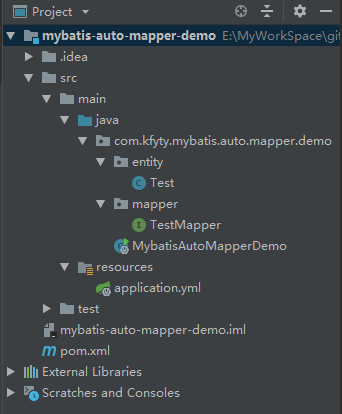
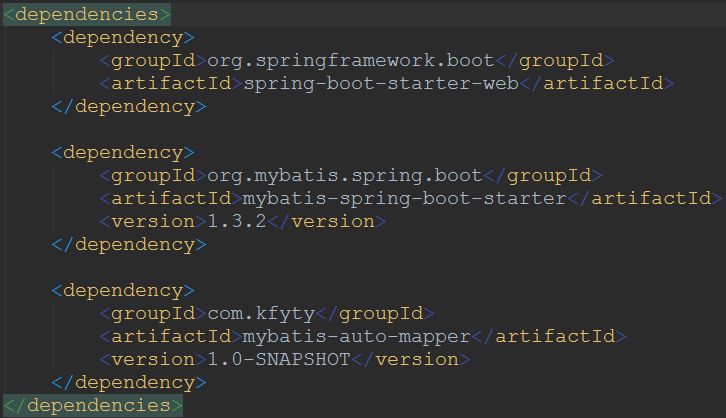
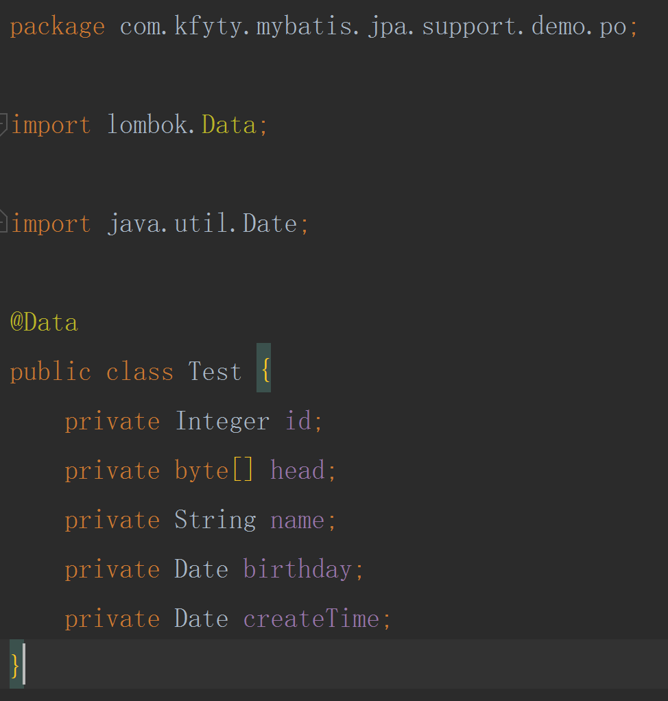
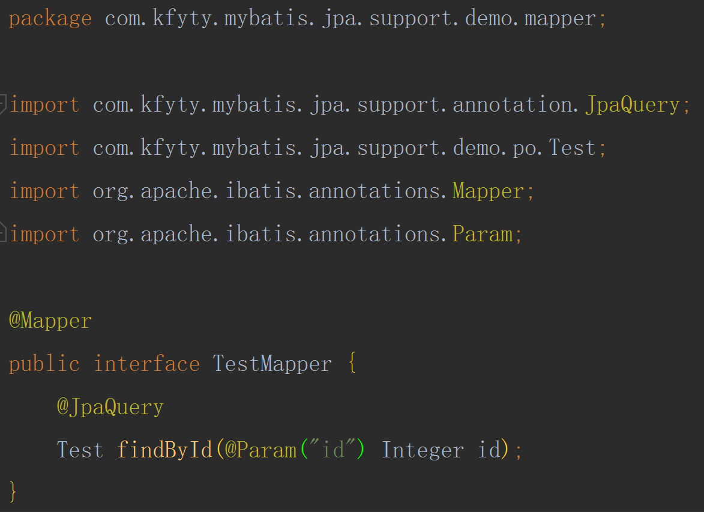
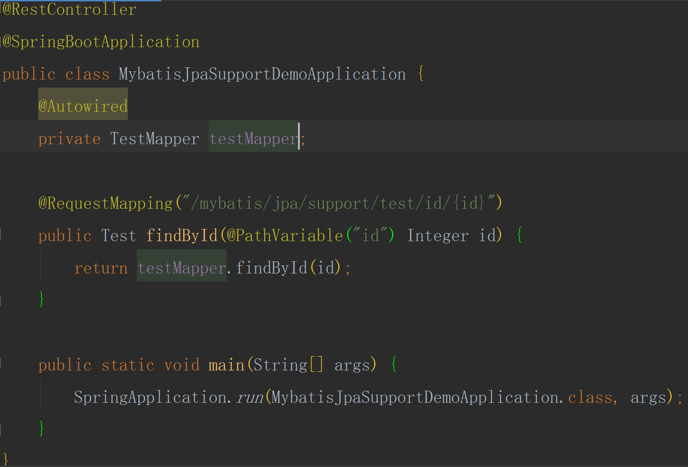
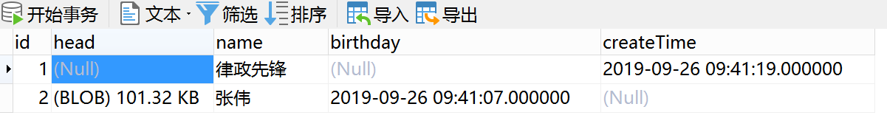
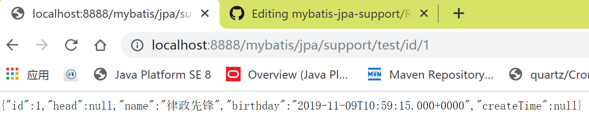
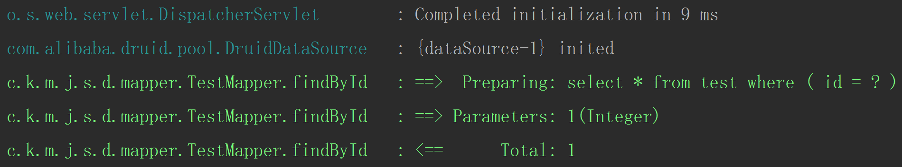

# mybatis-auto-mapper
mybatis 扩展包，只需引入该依赖，不需任何附加配置，就可拥有具有类似 jpa 的功能

下面演示一下：
首先建立一个普通的 springboot 项目，项目结构如下：
(这真是一个简单的不能再简单的项目了...  注意哦，没有 Mapper.xml 文件 ！！！)

重要依赖如下，第一个就是本项目了(最新版本 artifactId 已更新为 mybatis-auto-mapper)：

实体类：

Mapper 接口：
(注意：由于没有 Mapper.xml 文件，所以需要也只需要添加 @JpaQuery(最新版本已更新为 @AutoMapper 注解) 注解，这样就能生成 sql 语句并执行了，且这种解析在整个过程中只会解析一次！)

启动类：

浏览器访问之前先看一下数据库的数据：

看看结果如何呢：

最后看看打印的 log 日志：

结束！

有兴趣的可以 clone 试试哦！

PS：更多语法请参照项目中的 SQLConditionEnum.java 文件(编写方法实例请参照 MybatisAutoMapperTest.java 文件)
